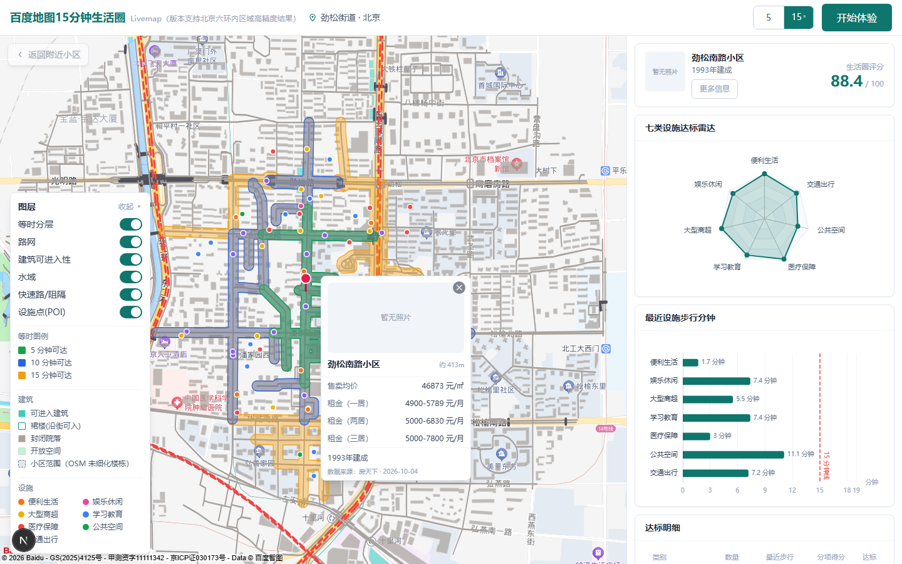
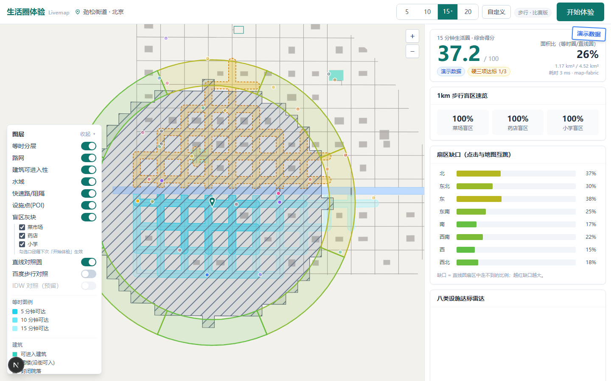
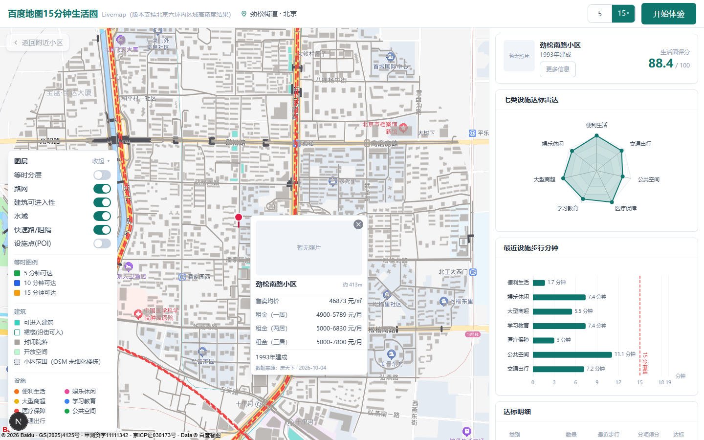
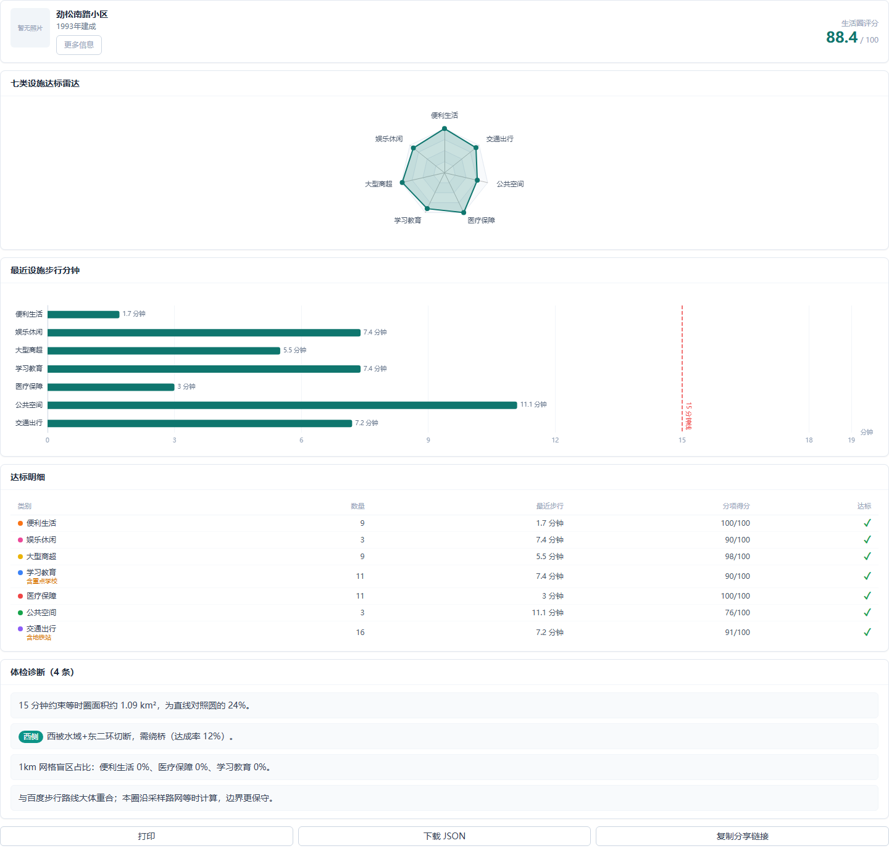

# 对比报告：约束步行底图等时圈 vs 直线圆

**数据口径声明**：本报告数字由 `scripts/compare_report.py` 在**真实 OSM 裁片底图**（`data/map_fabric/{jinsong,zhongguancun,nanyuan}/`，由 `scripts/import_osm_fabric.py` 从北京 OSM PBF 切出）上实跑产生；POI 为无 AK 降级路径的**确定性合成设施**（固定种子，名称取自合成名池，非真实商户）。报告验证的是**方法与工程链路**，不代表真实街区体检结论。

> **历史口径提示**：下文「菜场/药店/小学」「硬三项」「覆盖 8」等表述基于**旧八类设施体系**生成；当前代码已重构为**七类体系**（便利生活/娱乐休闲/大型商超/学习教育/医疗保障/公共空间/交通出行，锚点三项 = 便利生活/医疗保障/学习教育，交通一票制）。本表数字保留作历史对照，重跑前须按新口径重新生成（见 `.trae/documents/七类设施分类重构方案.md`）。

- 早期合成底图包保留在 `data/map_fabric/*_synth/` 供对照；本报告所有数字基于真实裁片。
- 引擎预热时即注入劲松演示对照折线（`engine.build_engine`），图状态从启动起确定：**任意 case 顺序、任意进程重跑，数字完全一致**。
- 复现：

```bash
# Windows
.venv\Scripts\python scripts\compare_report.py
# macOS / Linux
.venv/bin/python scripts\compare_report.py
```

脚本直接调用 `apps/api` 的编排层（`run_checkup`，`allow_snapshot=False` 跳过快照强制实算），分钟档：劲松 5/15/20、中关村 15、南苑 15。



## 1. 方法说明

| | 约束步行底图（本项目主引擎） | 直线圆（对照） |
|---|---|---|
| 形态 | 沿可步行路网的可达边缓冲融合成斑，让开住宅楼外扩 1.5m 墙区、未架桥水域、无步道快速路 | 以中心为圆心、`80m/min × X` 为半径的圆 |
| 面积口径 | 等时斑多边形面积（含过桥飞地） | `π × (80X)²` |
| 耗时口径 | 图上一次带截止 Dijkstra（边权=长度/速度，步行 80m/min、台阶 50、室内廊道 70） | 直线距离 / 80m/min |
| 建筑处理 | 商场可穿行（1.1× 速度）、办公只走底商廊道、住宅不可穿 | 不处理 |
| 穿水/穿阻隔例外 | 仅 bridge=yes 或 tunnel=yes 的 footway/path/steps（桥与地道同级，均不得穿建筑） | 不处理 |

面积比 = 等时斑面积 / 直线圆面积。**面积比越低，说明直线圆「虚报」的可达范围越大**——圆把人走不过去的楼、河、快速路全算成了可达。





本轮真实裁片图规模：劲松 1710 节点 / 2417 边（含预热注入的 2 条百度演示对照折线 64 条边）、中关村 4849 / 6867、南苑 678 / 821；三区域预热建图约 4.2 s。

## 2. 总表（现场实算，无缓存首算）

| 样例 | 分钟 | 等时圈面积 | 直线圆面积 | 面积比 | 综合分 | 硬三项达标 | 飞地 | 引擎耗时 |
|---|---|---|---|---|---|---|---|---|
| 劲松 | 5 | 0.18 km² | 0.50 km² | **35.0%** | 20.0 | 1/3 | 4 | 99 ms |
| 劲松 | 15 | 1.50 km² | 4.52 km² | **33.2%** | 61.4 | 2/3 | 13 | 549 ms |
| 劲松 | 20 | 2.42 km² | 8.04 km² | **30.1%** | 82.1 | 3/3 | 19 | 898 ms |
| 中关村 | 15 | 1.65 km² | 4.52 km² | **36.4%** | 59.9 | 3/3 | 20 | 658 ms |
| 南苑 | 15 | 0.73 km² | 4.52 km² | **16.2%** | 27.8 | 1/3 | 0 | 70 ms |

性能：上表为冷启动首算耗时（0.07–0.9 s，含盲区/扇区/报告编排的总墙面时间 0.1–1.2 s）；命中 `nodeId+minutes` 缓存后 **1–5 ms**，满足「快拍 <300 ms（fast 档）、精拍 <1.5 s」预算。

### 三类硬指标最近步行分钟（图上 Dijkstra）

| 样例 | 分钟 | 菜场 | 药店 | 小学 |
|---|---|---|---|---|
| 劲松 | 5 | 检索半径内不可达 | 不可达 | **4.2 min ✓** |
| 劲松 | 15 | 不可达 | **7.7 min ✓** | **4.2 min ✓** |
| 劲松 | 20 | **17.6 min ✓** | **7.7 min ✓** | **4.2 min ✓** |
| 中关村 | 15 | 13.7 min ✓ | 12.5 min ✓ | 14.8 min ✓ |
| 南苑 | 15 | **14.5 min ✓** | 不可达 | 不可达 |

> 「不可达」= 合成设施虽在检索半径内，但图上 X 分钟走不到——正是直线圆口径会漏报的情形。劲松样例中心东侧被东二环、东侧远处被东三环压住，西向需绕水域；南苑路网稀疏（678 节点），药店/小学在检索半径内但步行超时。

### 1 km 三类盲区占比（增强口径：步行 >X 分钟不可达）

| 样例 | 分钟 | 菜场盲区 | 药店盲区 | 小学盲区 |
|---|---|---|---|---|
| 劲松 | 5 | 100% | 100% | 100% |
| 劲松 | 15 | 100% | 100% | 100% |
| 劲松 | 20 | 86.4% | 86.4% | 86.4% |
| 中关村 | 15 | 91.5% | 91.5% | 91.5% |
| 南苑 | 15 | 100% | 100% | 100% |

> 口径说明：盲区**网格范围写死 1 km、格宽 100 m，不随 X 缩放**；每格判定为「直线 1 km 内无该类设施」，而提供步行分钟时启用增强口径「步行 >X 分钟不可达」才算缺（`blindspots(enhanced=True)`，前端默认开启）。因此占比会随 X 变化：劲松 15→20 分钟档，部分格内设施从「15 分钟走不到」变为「20 分钟可达」，盲区 100%→86.4%。
>
> 说明：早期版本在图层面板提供「盲区灰块」图层与单类/复合勾选（`blindFilter` 传参），**该地图图层与筛选控件已移除**，现只在报告中给出三类占比；引擎的 `categories` 口径仍然保留。

## 3. 劲松 5 / 20 分钟与 15 分钟对比（X 可配的证明）

| 劲松 | 分层（分钟） | 各层面积 | 面积比 | 综合分 |
|---|---|---|---|---|
| 5 分钟 | 3 / 5 | 0.07 / 0.18 km² | 35.0% | 20.0 |
| 15 分钟（默认） | 5 / 10 / 15 | 0.18 / 0.78 / 1.50 km² | 33.2% | 61.4 |
| 20 分钟 | 5 / 10 / 15 / 20 | 0.18 / 0.78 / 1.50 / 2.42 km² | 30.1% | 82.1 |

解读：

- **面积比随 X 下降**（35%→33%→30%）：分钟数越小，人主要在楼下路网走，直线圆虚报相对少；分钟数越大，东二环/东三环与水域的「天花板」效应越强——多出来的 5 分钟大多耗在绕行通道上，圆的半径却线性放大。
- **一次 Dijkstra 出全部层**：5/10/15/20 四层来自同一次截止搜索（禁止每层各跑一次），20 分钟档首算仍 <1 s。
- **达标项随 X 增加**：劲松 5 分钟 1/3（小学 4.2 min）、15 分钟 2/3（+药店 7.7 min）、20 分钟 3/3（+菜场 17.6 min），综合分 20.0→61.4→82.1——分母为当前 X，无写死的 15。

## 4. 扇区最差方向分析（8 向：缺口 = 1 − 达成率）

| 样例 | 最差方向 | 缺口（走不到） | 指认阻隔物 |
|---|---|---|---|
| 劲松 5 | 西北 | 94.1% 走不到 | —（5 分钟圈未触及 labeled 阻隔） |
| 劲松 15 | 西 | 83.5% 走不到 | 水域+东二环 |
| 劲松 20 | 西 | 87.5% 走不到 | 水域+东二环 |
| 中关村 15 | 北 | 73.6% 走不到 | 华宇池+北四环西路 |
| 南苑 15 | 西北 | 99.8% 走不到 | —（路网稀疏原因） |

**劲松读法**：样例中心位于东二环西侧。西向扇面被水域与东二环压住，15/20 分钟档西向 **83.5%–87.5% 的面积走不到**，为最差方向；东向各扇区（东三环沿线）达成率相对最好（E 25%–28% 缺口），说明主圈沿东向路网展开。系统按 100 m 里程采样水域与快速路几何，把阻隔物名称挂到 8 方位（`sectorGaps[].barrierNote`，如 N/NE/E 向「东三环」、S 向 20 分钟档「京津城际线+东三环」），前端在报告与诊断句中展示为方位徽标（早期版本的地图扇区闪烁/互跳已移除）。20 分钟档西南向出现「京津城际线」标注，说明随圈层扩大，铁路阻隔开始进入扇面视野。


**对照**：中关村路网密、无大河横穿，最差方向缺口 73.6%（华宇池+北四环西路，北部被快速路压住，其余方向较均衡）；南苑整体路网稀疏（678 节点），西北向 99.8% 走不到且无 labeled 阻隔——小图幅内该方向几乎无可走边，属底图覆盖密度问题而非单点阻隔，诊断句按「建议实地核查」口径输出。

## 5. 10 个 POI 步行耗时抽查（劲松 15 分钟，图上耗时 vs 直线估算）

图上耗时 = 同一次截止 Dijkstra 的节点代价；直线估算 = haversine / 80m/min。POI 为确定性合成设施（固定种子），名称取自合成名池。

| POI | 类别 | 图上耗时 | 直线估算 | 绕行系数 | 百度 App 实测 |
|---|---|---|---|---|---|
| 绿源生鲜超市 | 菜场 | 9.6 min | 6.9 min | 1.39 | 待填 |
| 优品生活超市 | 菜场 | 7.6 min | 5.8 min | 1.31 | 待填 |
| 便民菜场 | 菜场 | 18.0 min | 14.1 min | 1.28 | 待填 |
| 同仁堂药店 | 药店 | 19.9 min | 17.5 min | 1.14 | 待填 |
| 百姓阳光药房 | 药店 | 10.0 min | 8.6 min | 1.17 | 待填 |
| 好得快药店 | 药店 | 16.8 min | 15.1 min | 1.11 | 待填 |
| 医保全新大药房 | 药店 | 7.9 min | 7.8 min | 1.01 | 待填 |
| 文华小学 | 小学 | 3.7 min | 3.5 min | 1.05 | 待填 |
| 实验小学 | 小学 | 9.5 min | 9.2 min | 1.03 | 待填 |
| 阳光小学 | 小学 | 17.6 min | 13.5 min | 1.30 | 待填 |

> 绕行系数全部落在 **1.01–1.39**：POI 吸附到最近路口节点（度 2 收缩后节点只在路口），节点与 POI 位置的 ±数十米差可造成 ±0.1 级系数波动；无 >1.5 的异常个案。

**「百度 App 实测」列填写操作步骤**（有 AK 环境执行）：

1. 配置 AK：服务端 `BAIDU_AK`（`apps/api/.env`），前端 `NEXT_PUBLIC_BAIDU_JS_AK`（`apps/web/.env.local`），重启 API 与 Web；
2. 触发第三拍校准：对劲松样例中心发起一次非 demo 的 full 体验（前端把「演示数据」角标消失即为非 demo），编排层第三拍自动对最近重点 POI 调 `BaiduClient.walking_route` / `walking_matrix`（RouteMatrix 步行），并用 `calibrate_walk_minutes` 产出校准分钟（响应 `baiduRoutes` 字段可见注入折线）；
3. 手动复核（可选）：`GET/POST /api/v1/checkup` 返回的 POI 表含校准后分钟；或直接用 `scripts/` 下 Python 调 `BaiduClient.walking_matrix(origin, destinations)` 批量取同一起终点矩阵；
4. 同步人工核对：在百度地图 App 输入同一起终点选步行，记录 App 耗时填入上表「百度 App 实测」列；
5. 判定规则：期望图上耗时 ≥ 百度耗时（本系统更保守——住宅不可穿、未知建筑默认墙）；偏差 >30% 的条目按规格书要求标「底图与百度不一致」。

## 6. 结论

1. 直线圆在劲松虚报约 3 倍可达面积（15 分钟档等时圈仅为圆的 33.2%，南苑低至 16.2%），主要虚报来自不可穿越地块、东二环/东三环与水域；
2. 约束底图等时圈能**指认**「哪一侧被什么挡住」（8 向扇区 + 阻隔物标注），这是直线圆/插值斑给不出的信息；
3. X 可配（5/15/20 全链路重算），一次 Dijkstra 多层输出，冷算 0.07–0.9 s、缓存 <5 ms；面积比随 X 单调下降（35%→33%→30%），达标项与综合分随 X 上升（20.0→61.4→82.1）；
4. 盲区网格范围（1 km）不随 X 缩放；增强口径「步行 >X 分钟不可达」随 X 变化（劲松 15→20 分钟档 100%→86.4%）。


